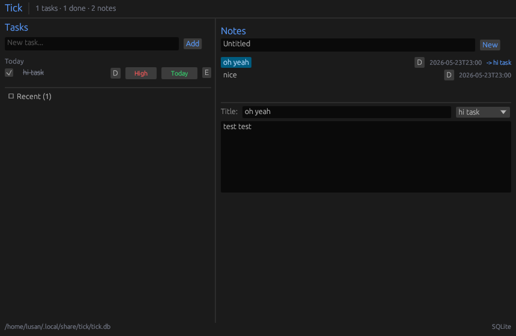

# Tick

A native desktop task tracker and notes app built with Rust and egui. Manage tasks with scheduling and priorities alongside linked plaintext notes all in a single, responsive viewport.

## Features

### Tasks
- **Scheduling** organize tasks into Today, Tomorrow, Scheduled, or Backlog. Cycle through groups by clicking the schedule badge.
- **Priorities** assign Low, Medium, High, or None to each task.
- **Inline editing** click the edit icon to rename a task in place.
- **In-group completion** checked tasks stay visible in their group with strikethrough, so your daily plan remains readable.
- **Recent section** expandable list of all completed tasks at the bottom. Uncheck to restore.
- **Delete with confirmation** no accidental deletions.

### Notes
- **Plaintext editor** multiline note editing with auto-save.
- **Task linking** attach notes to any task. Filter to see only linked notes, or browse all.
- **Standalone notes** notes can exist independently without a task.
- **Link dropdown** change or remove a note's task association from the editor.

### General
- **SQLite persistence** all data stored locally in `~/.local/share/tick/tick.db` (Linux), auto-saved on every change.
- **Resizable panels** drag the visible grip between the task list and notes to resize.
- **Dark theme** custom dark color scheme designed for all-day use.
- **Keyboard shortcuts** Enter to add tasks, Enter to confirm edits.

## Screenshot



## Build

Requires Rust 1.70+.

```bash
cargo build --release
```

The binary will be at `target/release/tick`.

## Resource Usage

Release build, idle, Linux (NVIDIA):

| Metric | Value |
|--------|-------|
| Binary size | **5.3 MB** (stripped, LTO, `opt-level = "z"`) |
| RSS | ~106 MB |
| PSS (proportional) | ~40 MB |
| CPU (idle) | 0% |

The RSS-PSS gap (~66 MB) is GPU driver shared libraries (LLVM, NVIDIA EGL/GLX) counted at full weight in RSS but shared across all OpenGL apps. The application itself uses roughly 40 MB of unique memory: ~5 MB binary text, ~3 MB heap, ~2 MB window framebuffer, and ~30 MB OpenGL context + font atlas.

Optimizations applied: `accesskit` disabled, egui `multi_threaded` disabled, depth/stencil/MSAA buffers zeroed, `-C panic=abort`, `-C lto=fat`, `-C codegen-units=1`, `-C opt-level=z`.

## Dependencies

| Crate | Purpose |
|-------|---------|
| [eframe](https://crates.io/crates/eframe) / [egui](https://crates.io/crates/egui) | GUI framework |
| [rusqlite](https://crates.io/crates/rusqlite) (bundled) | Local SQLite database |
| [chrono](https://crates.io/crates/chrono) | Timestamps |
| [dirs](https://crates.io/crates/dirs) | Platform data directory |

## Data

The SQLite database is created automatically on first launch. Schema migrations run on open, so upgrading from an older version is seamless.

### Tables

**tasks**
| Column | Type | Notes |
|--------|------|-------|
| id | INTEGER PK | |
| title | TEXT | |
| completed | INTEGER | 0 or 1 |
| priority | INTEGER | 0=None, 1=Low, 2=Medium, 3=High |
| position | INTEGER | Display order |
| schedule | INTEGER | 0=Backlog, 1=Today, 2=Tomorrow, 3=Scheduled |
| created_at | TEXT | ISO 8601 |

**notes**
| Column | Type | Notes |
|--------|------|-------|
| id | INTEGER PK | |
| title | TEXT | |
| content | TEXT | |
| task_id | INTEGER? | FK to tasks, nullable |
| created_at | TEXT | ISO 8601 |
| updated_at | TEXT | ISO 8601 |

## License

MIT
